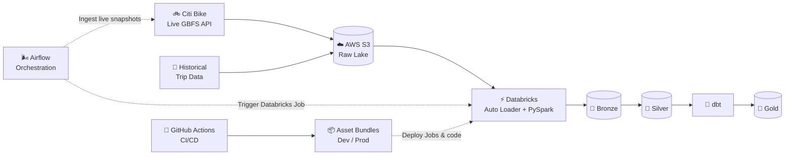
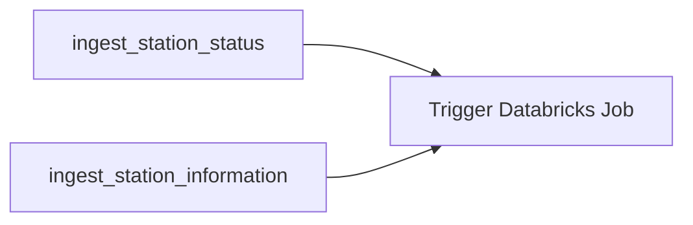

# 🚲 Citi Bike Data Platform

> End-to-end data engineering platform for live and historical Citi Bike data using **Apache Airflow, AWS S3, Databricks, Spark, Delta Lake, dbt, Docker, and GitHub Actions**.

<p align="center">
  <b>Airflow orchestrates · S3 stores · Databricks processes · dbt models</b>
</p>

---

## 🏗️ Architecture



---

## ⚙️ Tech Stack

| Layer | Technology |
|---|---|
| Orchestration | Apache Airflow |
| Storage | AWS S3 |
| Data Platform | Databricks |
| Processing | PySpark / Apache Spark |
| Lakehouse | Delta Lake |
| Incremental Ingestion | Databricks Auto Loader |
| Analytics Engineering | dbt |
| Containerization | Docker |
| Deployment | Databricks Asset Bundles |
| CI/CD | GitHub Actions |

---

## ✨ Engineering Highlights

### Incremental ingestion

Databricks Auto Loader processes only newly arrived files instead of rescanning the full raw data lake.

```text
New Snapshot
    ↓
AWS S3
    ↓
Auto Loader
    ↓
Checkpoint
    ↓
Only New Files Processed
```

### Delta MERGE upserts

Silver station data is maintained using Delta Lake `MERGE`.

```text
Latest Station Records
        ↓
     Delta MERGE
      /       \
   UPDATE     INSERT
```

This keeps the current station state up to date without blindly appending duplicates.

### Cross-platform orchestration

Airflow manages ingestion, dependencies, retries, scheduling, and Databricks job triggering.



The two live ingestion tasks run in parallel. Databricks starts only after both succeed.

### Dev / Prod deployment

The same codebase deploys into isolated environments:

```text
Development → citibike_dev
Production  → citibike_prod
```

Databricks Asset Bundles define Jobs and deployment configuration as code.

---

## 🔄 CI/CD


This replaces manual production job configuration with version-controlled deployment.

---

## 📊 Live + Historical Pipelines

### Live Pipeline

```text
station_status ───────────┐
                          ├── Silver Stations ──► dbt Gold
station_information ──────┘
```

### Historical Pipeline

```text
Monthly Citi Bike Trips
          ↓
       Bronze
          ↓
       Silver
          ↓
   Analytics Models
```

---

## 🧩 Engineering Decisions & Challenges

### 1. Schema Drift & Pipeline Resilience

The live Citi Bike API introduced previously unseen fields, causing the original Auto Loader / Delta pipeline to fail.

The Bronze layer was hardened using:

```python
.option("cloudFiles.schemaEvolutionMode", "rescue")
.option("mergeSchema", "true")
```

This allows unexpected upstream fields to be preserved while keeping ingestion resilient.

### 2. Station ID Normalization & Entity Resolution

Historical data contained inconsistent station identifiers.

Examples included malformed IDs such as:

```text
5017.01_
```

as well as different IDs such as:

```text
5017.03
5017.04
```

that were later identified as the same physical station.

Instead of hard-coding corrections inside SQL models, I created a **dbt seed mapping table** to maintain canonical station IDs.

```text
Raw Station IDs
      ↓
dbt Seed Mapping
      ↓
Canonical Station ID
```

This keeps reference-data corrections explicit, reusable, version-controlled, and easy to maintain.

---

## 🛡️ Reliability

The pipeline includes:

- Auto Loader checkpoints
- Schema tracking and rescue
- Delta schema evolution
- Delta MERGE upserts
- Airflow dependency management
- Databricks task retries
- `max_active_runs=1`
- Timestamped raw snapshots
- Source file lineage
- Separate dev / prod environments

---

## ✅ End-to-End Validation

The full pipeline was successfully validated:

```text
Citi Bike API
      ↓
Airflow
      ↓
AWS S3
      ↓
Databricks Auto Loader
      ↓
Bronze
      ↓
Silver
      ↓
dbt Gold
      ↓
SUCCESS
```

Production records were traced back to their corresponding S3 source files using ingestion metadata such as:

```text
_source_file
_ingested_at
```

---

## 📁 Project Structure

```text
citibike-data-platform/
│
├── airflow/
│   ├── dags/
│   ├── Dockerfile
│   ├── requirements.txt
│   └── docker-compose.yml
│
├── src/
│   └── citibike_data_platform/
│       ├── bronze/
│       └── silver/
│
├── citibike_dbt/
│   └── models/
│
├── resources/
│
├── .github/workflows/
│   ├── ci.yml
│   └── cd.yml
│
├── databricks.yml
└── README.md
```

---

## 🐳 Reproducibility

The Airflow environment is fully containerized with Docker Compose, making the orchestration stack and project dependencies reproducible across local environments.

Secrets, AWS credentials, Databricks tokens, Airflow logs, and generated local configuration files are excluded from version control.

---

## 👋 About Me

I'm **Huaxi**, a Statistics student at the **University of British Columbia** focused on **Data Engineering and Data Analytics**.

I enjoy building data systems that go beyond standalone notebooks by combining ingestion, distributed processing, orchestration, cloud infrastructure, analytics modeling, and CI/CD into complete end-to-end platforms.

**Interests:** Data Engineering · Analytics · Spark · Cloud Data Platforms · AI Data Infrastructure

[GitHub](https://github.com/Tom0809)
