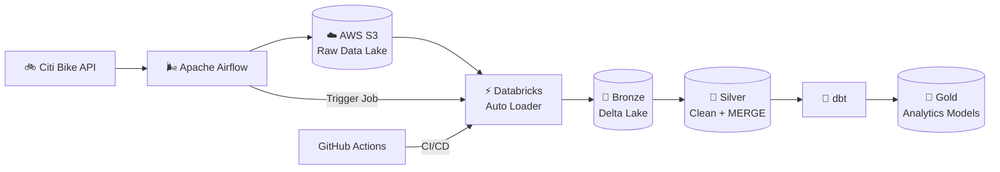
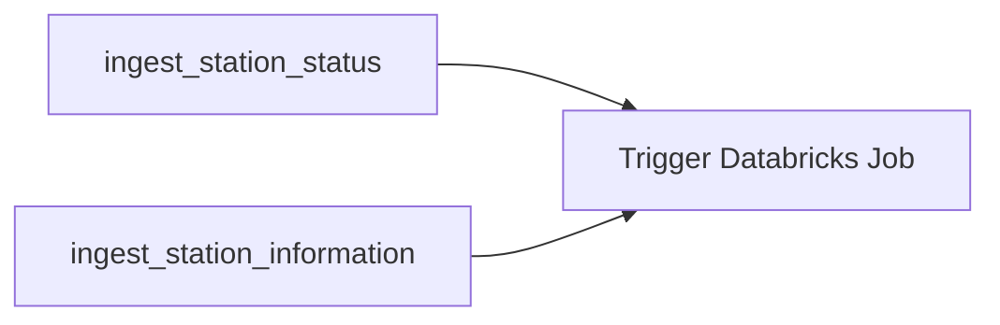

# 🚲 Citi Bike Data Platform

> End-to-end data engineering platform for live and historical Citi Bike data using **Airflow, AWS S3, Databricks, Spark, Delta Lake, dbt, Docker, and CI/CD**.

<p align="center">
  <b>Live API → Airflow → S3 → Databricks → Delta Lake → dbt → Analytics</b>
</p>

---

## 🏗️ Architecture



### What the pipeline does

```text
Live Citi Bike API
       │
       ▼
Airflow captures station snapshots
       │
       ▼
Timestamped JSON → AWS S3
       │
       ▼
Databricks Auto Loader
       │
       ▼
Bronze → Silver → dbt Gold
       │
       ▼
Analytics-ready data
```

---

## ⚙️ Tech Stack

| | Technology |
|---|---|
| **Orchestration** | Apache Airflow |
| **Cloud Storage** | AWS S3 |
| **Data Platform** | Databricks |
| **Processing** | PySpark / Apache Spark |
| **Lakehouse** | Delta Lake |
| **Incremental Ingestion** | Databricks Auto Loader |
| **Analytics Engineering** | dbt |
| **Containerization** | Docker |
| **Deployment** | Databricks Asset Bundles |
| **CI/CD** | GitHub Actions |

---

## ✨ Engineering Highlights

### Incremental ingestion

Auto Loader processes only newly arrived files instead of rescanning the full data lake.

```text
New API Snapshot
      ↓
S3 Raw
      ↓
Auto Loader
      ↓
Checkpoint
      ↓
Only New Files Processed
```

### Reliable Delta upserts

Silver station data is maintained using **Delta MERGE**:

```text
Latest Station Records
        │
        ▼
     Delta MERGE
      /       \
   UPDATE     INSERT
```

This keeps the Silver layer current without blindly appending duplicate records.

### Schema drift protection

During testing, the upstream Citi Bike API introduced new fields and caused the streaming pipeline to fail.

The pipeline was hardened with:

```python
.option("cloudFiles.schemaEvolutionMode", "rescue")
```

and:

```python
.option("mergeSchema", "true")
```

Result:

```text
Upstream Schema Change
        ↓
Auto Loader detects new fields
        ↓
Unknown fields rescued
        ↓
Delta schema evolves
        ↓
Pipeline continues
```

### Cross-platform orchestration

Airflow coordinates systems outside Databricks:



The two API ingestion tasks run in parallel. Databricks starts only after both succeed.

### Dev / Prod deployment

The same codebase deploys into separate environments:

```text
Development → citibike_dev
Production  → citibike_prod
```

Databricks Asset Bundles define Jobs and deployment configuration as code.

---

## 🔄 CI/CD


This replaces manual production Job configuration with version-controlled deployment.

---

## 📊 Live + Historical Pipelines

### Live Pipeline

```text
station_status ───────────┐
                          ├── Silver Stations ──► dbt Gold
station_information ──────┘
```

### Historical Pipeline

```text
Monthly Citi Bike Trips
          ↓
       Bronze
          ↓
       Silver
          ↓
   Analytics Models
```

---

## 🛡️ Reliability

The project includes:

- Auto Loader checkpoints
- Schema tracking
- Schema rescue
- Delta schema evolution
- Delta MERGE upserts
- Airflow dependency management
- Databricks task retries
- `max_active_runs=1`
- Raw snapshot history
- Source file lineage
- Separate dev / prod environments

---

## 🧪 Real Engineering Problems Solved

This project was tested against real integration failures rather than only happy-path examples.

```text
S3 authorization issue
        ↓
Databricks authentication expiration
        ↓
API schema drift
        ↓
Auto Loader failure
        ↓
Delta metadata mismatch
        ↓
Airflow / Databricks retry debugging
        ↓
Successful end-to-end recovery
```

The final pipeline successfully ran:

**Citi Bike API → Airflow → S3 → Databricks → Bronze → Silver → dbt Gold**

---

## 📁 Project Structure

```text
citibike-data-platform/
│
├── airflow/
│   ├── dags/
│   ├── Dockerfile
│   ├── requirements.txt
│   └── docker-compose.yml
│
├── src/
│   └── citibike_data_platform/
│       ├── bronze/
│       └── silver/
│
├── citibike_dbt/
│   └── models/
│
├── resources/
│
├── .github/workflows/
│   ├── ci.yml
│   └── cd.yml
│
└── databricks.yml
```

---

## ✅ Verified End-to-End

A successful run was validated using production data lineage:

```text
Airflow Snapshot
2026-09-23 00:26:30 PDT
        ↓
S3
station_status_20260923T072630Z.json
        ↓
Databricks Auto Loader
        ↓
Bronze ingestion
2026-09-23 00:27:02 PDT
        ↓
Silver + Gold
        ↓
Airflow DAG SUCCESS
```

---

## 🚀 Run Airflow Locally

```bash
cd airflow
docker compose up -d
```

Open:

```text
http://localhost:8080
```

Stop the environment:

```bash
docker compose down
```

---

## 👋 About Me

I'm **Tom**, a Statistics student at the **University of British Columbia** focused on **Data Engineering and Data Analytics**.

I enjoy building data systems that go beyond standalone notebooks — combining ingestion, distributed processing, orchestration, cloud infrastructure, analytics modeling, and CI/CD into complete end-to-end platforms.

**Interests:** Data Engineering · Analytics · Spark · Cloud Data Platforms · AI Data Infrastructure

[GitHub](https://github.com/Tom0809)
